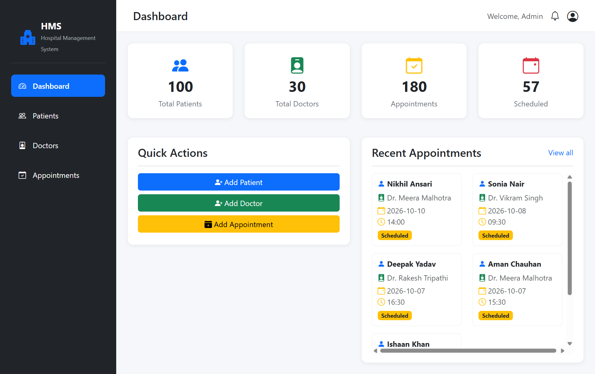
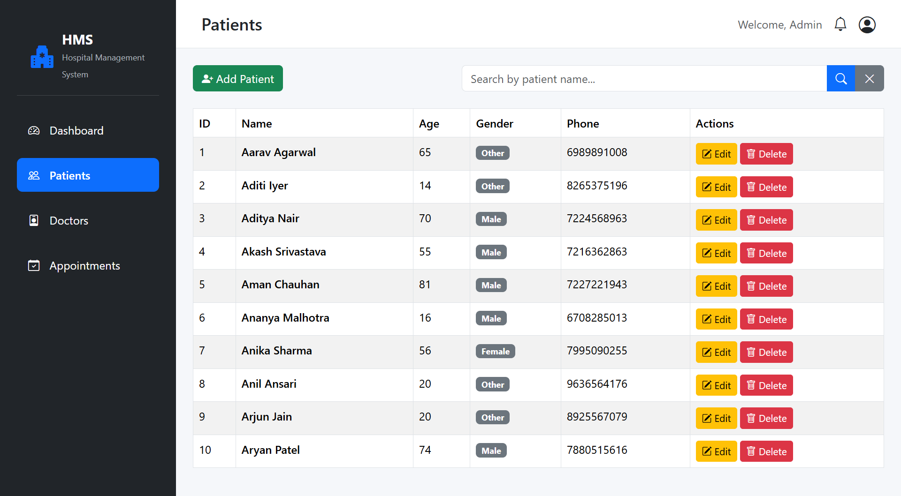
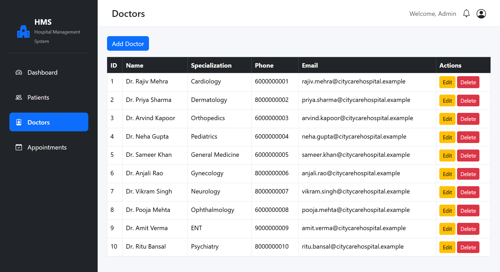
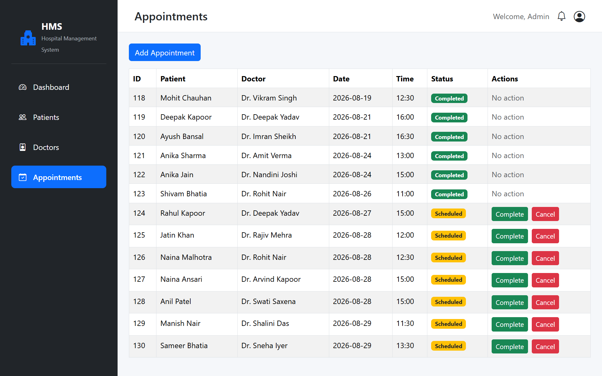

# 🏥 Hospital Management System

A full-stack web-based Hospital Management System built with **Python, Flask, SQLite, HTML, CSS, Bootstrap, and JavaScript**.

This project is a practical portfolio application demonstrating backend development, relational database design, CRUD operations, server-side validation, application integrity, and responsive UI development.

---

## 📌 Overview

The Hospital Management System provides a centralized interface for managing **patients, doctors, and appointments**.

The application includes a dashboard for viewing key statistics and recent appointments, along with search, filtering, validation, and database-level protection for important operations.

---

## ✨ Features

### 👤 Patient Management

- Add new patients
- View patient records
- Search patients by name
- Edit patient information
- Delete patients
- Prevent deletion when a patient has existing appointments
- Server-side validation
- Browser-side validation
- Age validation
- Phone number validation
- Preserve form values after validation errors
- Patient records displayed in ID order

### 👨‍⚕️ Doctor Management

- Add new doctors
- View doctor records
- Search by name or specialization
- Edit doctor information
- Delete doctors
- Prevent deletion when a doctor has existing appointments
- Phone number validation
- Email validation
- Preserve form values after validation errors

### 📅 Appointment Management

- Schedule appointments
- Select patients and doctors from the database
- Validate appointment date and time
- Track appointment status
- Search appointments by patient or doctor
- Filter appointments by status
- Prevent doctor double-booking
- Mark scheduled appointments as completed
- Cancel scheduled appointments
- Protect appointment status transitions

### 📊 Dashboard

- Total patient count
- Total doctor count
- Total appointment count
- Scheduled appointment count
- Recent appointments
- Quick action buttons
- Responsive dashboard layout
- Scrollable recent appointments panel

### 🛡️ Application & Database Integrity

- SQLite foreign-key enforcement
- Parameterized SQL queries
- Database path resolved relative to the project
- POST requests for destructive/state-changing operations
- Protected database relationships
- Proper handling of missing records
- Flash messages for user feedback
- Empty-state handling
- Consistent Flask `url_for()` routing

---

## 📸 Screenshots

### Dashboard

The dashboard provides an overview of the hospital system, including patient, doctor, and appointment statistics, quick actions, and recent appointments.



---

### Patient Management

The patient management interface allows users to view, search, edit, and manage patient records.



---

### Doctor Management

The doctor management interface provides doctor records along with specialization, contact information, and management actions.



---

### Appointment Management

The appointment management interface allows users to schedule, search, filter, and manage appointments and their statuses.



---

## 🛠️ Tech Stack

| Technology | Purpose |
|------------|---------|
| **Python** | Backend programming |
| **Flask** | Web framework |
| **SQLite** | Relational database |
| **HTML5** | Page structure |
| **CSS3** | Custom styling |
| **Bootstrap 5** | Responsive UI |
| **Bootstrap Icons** | Interface icons |
| **Jinja2** | Server-side templating |
| **JavaScript** | Client-side interactions |
| **Git & GitHub** | Version control |

---

## 📂 Project Structure

```text
hospital-management-system/
│
├── app.py
├── requirements.txt
├── README.md
├── .gitignore
│
├── database/
│   ├── db.py
│   ├── init_db.py
│   ├── seed_demo_data.py
│   └── hospital.db
│
├── templates/
│   ├── Components/
│   │   ├── navbar.html
│   │   └── sidebar.html
│   │
│   ├── add_appointment.html
│   ├── add_doctor.html
│   ├── add_patient.html
│   ├── appointments.html
│   ├── base.html
│   ├── dashboard.html
│   ├── doctors.html
│   ├── edit_doctor.html
│   ├── edit_patient.html
│   ├── home.html
│   └── patients.html
│
└── static/
    ├── css/
    │   └── style.css
    └── js/
        └── script.js
```

## 🚀 Installation

### 1. Clone the repository

```bash
git clone https://github.com/AmaanCoder786/hospital-management-system.git
cd hospital-management-system
```

### 2. Create a virtual environment

```bash
python -m venv venv
```

### 3. Activate it

**Windows PowerShell:**

```powershell
venv\Scripts\Activate.ps1
```

**Windows CMD:**

```cmd
venv\Scripts\activate
```

**Linux/macOS:**

```bash
source venv/bin/activate
```

### 4. Install dependencies

```bash
pip install -r requirements.txt
```

### 5. Initialize the database

For a fresh database, run:

```bash
python database/init_db.py
```
This creates the required database tables without deleting existing records.

### 6. Add sample/demo data

To populate the application with realistic demonstration data:
```bash
python database/seed_demo_data.py
```
⚠️ Warning: The seed script clears existing patient, doctor, and appointment records before inserting the demo dataset.

The included demo dataset contains:
    - 100 patients
    - 30 doctors
    - 180 appointments
  
### 7 . Start the application

```bash
python app.py
```

Open:

```text
http://127.0.0.1:5000
```

### 🧪 Demo Dataset

The project includes a sample dataset for demonstration and testing.

| Record Type |	Sample Count |
|------------|---------|
| **Patients** | 100 |
| **Doctors** | 30 |
| **Appointments** | 180 |

The appointment records are relationally linked to the corresponding patients and doctors.

To reset the application to the demonstration dataset:

```bash
python database/seed_demo_data.py
```
⚠️ This will remove the existing patient, doctor, and appointment records before generating the demo data.

## 🎯 What This Project Demonstrates

This project demonstrates practical experience with:

- Flask application development
- Routing and request handling
- CRUD operations
- SQLite relational database design
- SQL queries and joins
- Foreign-key relationships
- Server-side validation
- Client-side validation
- Jinja2 templating
- Bootstrap responsive UI
- JavaScript interactions
- Search and filtering
- Application state management
- Database integrity
- Git and GitHub workflow

## 🔐 Validation & Data Integrity

The application performs validation both in the browser and on the server.

Examples include:

- Required fields
- Patient age range validation
- Phone number validation
- Email validation
- Appointment date/time validation
- Valid patient and doctor relationships
- Prevention of doctor double-booking
- Protected appointment status changes
- Prevention of deleting patients/doctors with existing appointments

Database operations use parameterized SQL queries to reduce the risk of SQL injection.

## 🔮 Future Improvements

Potential future extensions include:

- Authentication and role-based access
- Medical records and patient history
- Prescription management
- Billing and payment management
- Reports and data export
- Application deployment

These features are outside the scope of the current release.

##  📦 Release

Current Version: v1.0.0

This release represents the first complete and stable version of the project.

## 👨‍💻 Author

**Amaan Khan**

MCA Student | Python Developer

GitHub: https://github.com/AmaanCoder786
